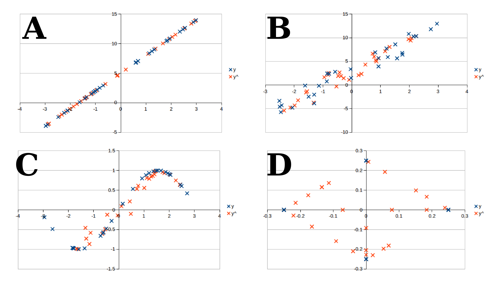

# meshRandom
Tool that simulates two-dimensional sample distribution based on a sample defined mesh  
GitHub: https://github.com/YujiSODE/meshRandom  
>Copyright (c) 2020 Yuji SODE \<yuji.sode@gmail.com\>  
>This software is released under the MIT License.  
>See LICENSE or http://opensource.org/licenses/mit-license.php  
______

## 1. Description
Tool that simulates two-dimensional sample distribution based on a sample defined mesh.

### shell
- `tclsh meshRandom.tcl N xyList;`
### Tcl
- `::meshRandom::randoms N xyList;`

  - `$N`: number of random coordinates to return
  - `$xyList`: a list of xy-coordinate data, and every element is expressed as `x,y`

## 2. Script
- `meshRandom.tcl`

It requires Tcl 8.6+.

## 3. Library list
- Sode, Y. 2018. lSum_min.tcl: https://gist.github.com/YujiSODE/1f9a4e2729212691972b196a76ba9bd0
- Sode, Y. 2018. lPairwise_min.tcl; the MIT License: https://gist.github.com/YujiSODE/0d520f3e178894cd1f2fee407bbd3e16
