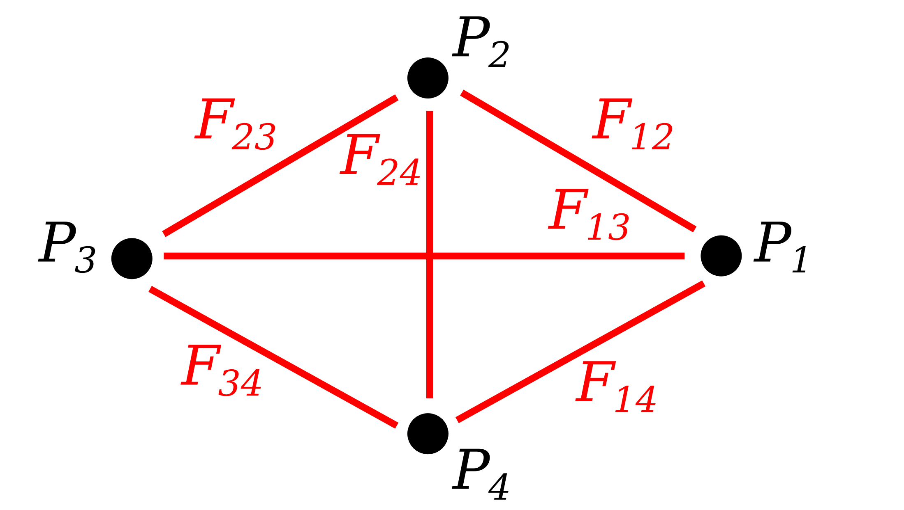

# meshRandom
Tool that simulates two-dimensional sample distribution based on a sample defined mesh  
GitHub: https://github.com/YujiSODE/meshRandom  
>Copyright (c) 2020 Yuji SODE \<yuji.sode@gmail.com\>  
>This software is released under the MIT License.  
>See LICENSE or http://opensource.org/licenses/mit-license.php  
______

<figure>
        
        <figcaption>
                <b>Figure</b> <b>1.</b> Diagram showing concept of <code>meshRandom</code>. 
                Filled circles show sample points. 
                Red lines show sample paths <i><code>Fij</code></i> beteween two sample points <i><code>Pi</code></i> and <i><code>Pj</code></i>.
        <figcaption>
</figure>
